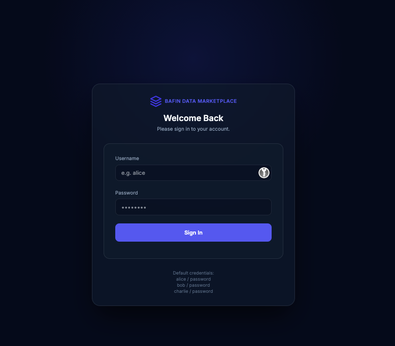
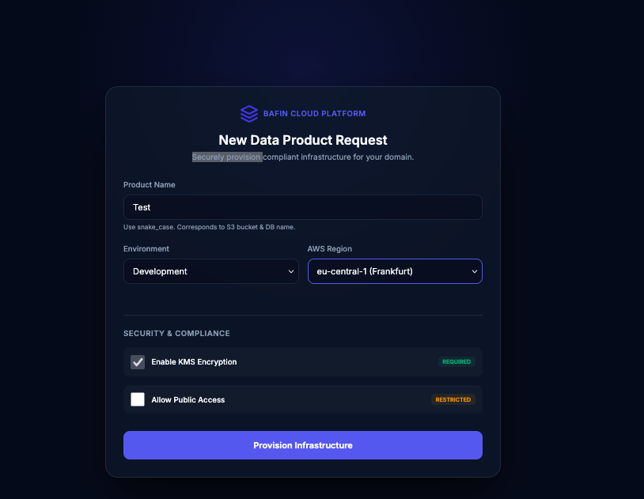
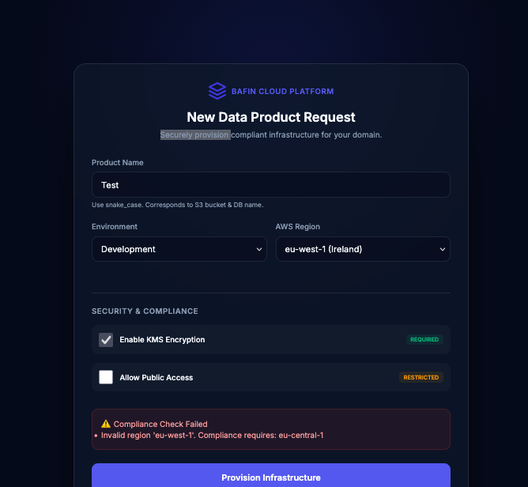
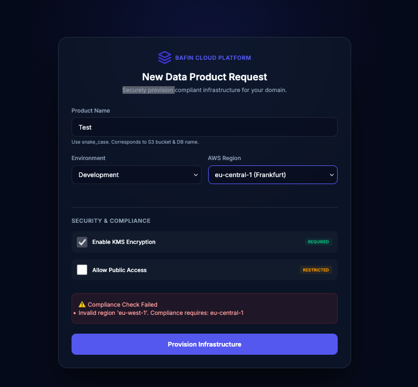
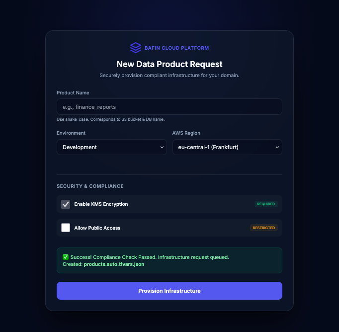
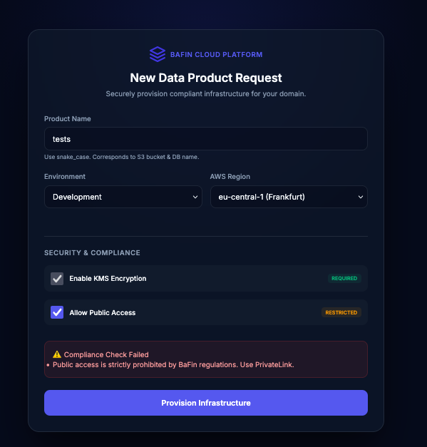

# BaFin Self-Service Cloud Data Platform

A compliant, self-service data platform designed for BaFin-regulated environments. This platform enables teams to provision secure, standardized data products on AWS and Snowflake using a self-service web portal.

## Architecture

- **Web Portal**: FastAPI backend + HTML/JS Frontend.
- **Infrastructure as Code**: Terraform modules for AWS (S3, KMS, VPC) and Snowflake (DB, Review, Role).
- **Orchestration**: Kubernetes (Local/EKS) with Argo CD for GitOps deployment.
- **Compliance**: Policy-as-Code checks before provisioning.

## Screenshots







*Application Flow: Dashboard -> Catalog -> Request -> Approval -> Notifications -> Data Preview*

## Getting Started

### Prerequisites
- Docker
- Kubernetes Cluster (Minikube, Kind, or Docker Desktop)
- Terraform
- Python 3.9+

### Local Web Portal Setup
1. **Build Docker Image**
    ```bash
    docker build -t bafin-portal -f web_portal/Dockerfile .
    ```
2. **Deploy to Kubernetes**
    ```bash
    kubectl apply -f k8s/
    ```
3. **Access**
    The portal is available at `http://localhost` (or the Ingress IP).

### Cloud Infrastructure
The platform uses a hybrid model. The Terraform definitions in `terraform/modules` manage the cloud resources.

1. **Configure Credentials**: Ensure AWS and Snowflake credentials are set in your environment.
2. **Apply Foundation**:
    ```bash
    cd terraform
    terraform init
    terraform apply
    ```

## Usage
1. Log in to the portal.
2. Navigate to "New Product".
3. Fill in the required details (Name, Environment, Confidentiality).
4. Submit. The system validates the request against compliance rules and triggers the Terraform provisioning workflow.
